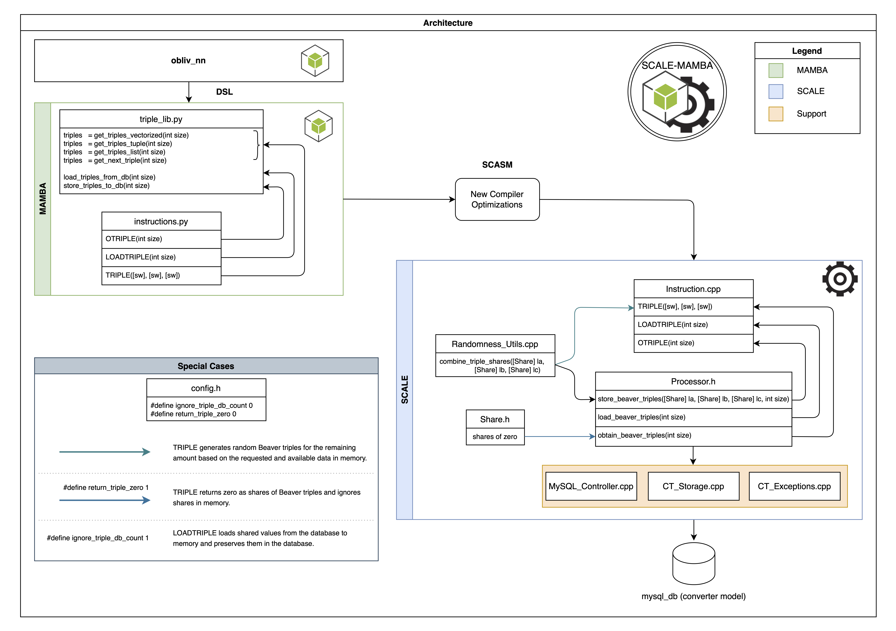

# Loading Beaver Triples from a DB.
To optimize RAM usage and streamline operations, our framework offers a convenient method for accessing random Beaver triples directly from a database (DB) whenever necessary. Here's a breakdown of the process in three straightforward steps:

1. We generate a set number of random Beaver triples, such as `size`, and securely store them in the private DBs of participating parties.
2. At the onset of the protocol, we retrieve the required Beaver triples from the DB and load them into memory.
3. Throughout the protocol execution, we utilize the Beaver triples stored in memory.

To ensure seamless execution of these tasks, we've introduced two new instructions, which we'll delve into further later on. Take a look at the outlined design below to grasp the overall workflow.

<div style = "text-align:center">
    
</div>

* **

## New System Instructions
The framework incorporates two new instructions and adapt the existing `TRIPLE` instruction to accommodate these updates. Additionally, a user-friendly library has been integrated for convenient utilization. In alignment with the original `SCALE MAMBA`, our new instructions operate by filling single vectors. These instructions include:

**`OTRIPLE(int)`:** The argument value, `size`, tells the system how many random Beaver triples you want to create in a single `OTRIPLE` invocation. You can call this instruction as follows: 
```python
        size = 100
        OTRIPLE(size)
```

Please note that when the `OTRIPLE` instruction is utilized, it generates the requested number of triples in the form of a list `(la, lb, lc)` as specified in [Instruction.cpp](../src/Processor/Instruction.cpp), and initiates the `store_beaver_triples()` process located in [Processor.h](../src/Processor/Processor.h). This process converts the list `(la, lb, lc)` into a vector of shares using the `combine_triple_shares()` method defined in [Randomness_Utils.cpp](../src/Utils/Randomness_Utils.cpp). It's essential to understand that the `store_beaver_triples()` function is called in batches of `beaver_triples_batch_size` (for more details, see [here](#batching-generation-of-beaver-triples)).

**`LOADTRIPLE(int)`:** This instruction, like `OTRIPLE`, requires an integer parameter named `size` as input. Its purpose is to retrieve values from the DB and store them in memory. It verifies whether the requested number of shared Beaver triples exists in the DB. If they are found, they are loaded into memory, specifically into the multimap [`beaver_triples`](../src/Processor/Processor.h), and then removed from the DB using the `read_then_delete()` function defined in [Converter_Storage.cpp](../src/Converter/Converter_Storage.cpp). If the required number of shared Beaver triples is not available in the DB, an exception is thrown indicating insufficient triples. You can use this instruction as follows:
```python
        size = 100
        LOADTRIPLE(size)
```

Additionally, we keep track of the Beaver triples that have been loaded by referencing their respective IDs from the DB entries. The ID of the latest Beaver triple, identified by `beaver_triples_id`, is stored in a map named `last_retrieved_index_per_channel_randomness[beaver_triples_id]`, as defined in the file [Processor.h](../src/Processor/Processor.h). The updating of this map happens within the `load_beaver_triples()` process within the same [Processor.h](../src/Processor/Processor.h) file.

**`TRIPLE(sw, sw, sw)`:** This instruction, referred to as `triple` to align with `SCALE-MAMBA`, initializes a shared random Beaver triple into the registers `sw, sw, sw`. The process responsible for this action is `obtain_beaver_triples()`, which initially verifies if the necessary number of values is available in memory by examining the multimap [`beaver_triples`](../src/Processor/Processor.h). If a sufficient number of values are present, they are utilized and removed from the multimap. However, if an insufficient number of values exist, the additional required amount is generated using the randomness generation logic of `OTRIPLE`, as defined in [Instruction.cpp](../src/Processor/Instruction.cpp). You can execute this instruction as shown below:
```python
        next_triple = (sint(), sint(), sint())
        triple(*next_triple)
```

**`TRIPLE(sw)`:** This variant of the `TRIPLE` instruction, as described previously, differs in that it takes a vectorized register `sw` as input and fills it with random Beaver triples. Each Beaver triple is composed of the values `(sw_{3i}, sw_{3i+1}, sw_{3i+2})`, where `0 ≤ i < size`. It's crucial to ensure that the size of the input register is a multiple of 3; otherwise, it will trigger a `bad_value()` error. You can use this instruction as shown below:

```python
        size = 100
        next_triples = sint(size=3*size)
        triple(*next_triples)
```

**`TRIPLE([sw])`:** This invocation of the `TRIPLE` instruction resembles the previous one, but with a distinction: it accepts a list of registers `[sw]` as input and fills them with random Beaver triples. Similar to the previous case, the size of the input list (`next_triples`) must be a multiple of 3. You can call this instruction as follows:

```python
        size = 100
        next_triples = [sint() for _ in range(3*size)]
        triple(*next_triples)
```

**`vTRIPLE(int, sw, sw, sw)`:** This corresponds to the vectorized implementation of the `TRIPLE` instruction. With this instruction, an extra `int` parameter is required, indicating the `size` number of Beaver triples to generate. Consequently, for each position `i` with `0 ≤ i < size`, the values `(a[i], b[i], c[i])` constitute a random Beaver triple. You can execute this instruction as follows:
```python
        size = 100
        a = sint(size=size)
        b = sint(size=size)
        c = sint(size=size)
        next_triples = (a, b, c)
        vtriple(size, *next_triples)
```

## Triples Library
We've added a new convenient library named [triple_lib.py](../Compiler/triple_lib.py) for straightforward access. This library encapsulates the functions discussed earlier, simplifying their usage and organization. Below is a summary of the available functionality. For clarity in presentation, we'll use `size = 100` as an example value throughout the description.

**Store Random Beaver Triples `store_triples_to_db(size)`:** Here you parametrize the number of random Beaver triples to be generated and stored. It returns no value. To generate and store Beaver triples to the DB, you can simply do the following:
```python
from Compiler.triple_lib import  store_triples_to_db

store_triples_to_db(100)
```

Additionally, we have provided the end user with a simple script for generating the required amount of random Beaver triples and storing them in the DB. To utilize this, users can simply run the script located at `Scripts/beaver-triples-gen.sh`.
```bash
cd Scripts
./beaver-triple-gen.sh
```


**Load Random Beaver Triples `load_triples_from_db(size)`:** Here you parametrize the number of random Beaver triples to be loaded from the DB to the memory. Please be aware that you need to have stored at least that many random Beaver triples in the DB before invoking this function. To load random Beaver triples, you can simply do the following:
```python
from Compiler.triple_lib import load_triples_from_db

load_triples_from_db(100)
```

**Instantiate a Random Beaver Triple `next_triple = get_next_triple()`:** It returns three `sint()` registers that correspond to a random Beaver triple of the form `(a, b, c)` with `c = ab`. To instantiate a random Beaver triple, you can simply do the following: 
``` python
from Compiler.triple_lib import get_next_triple

next_triple = get_next_triple()
```

Moreover, you can parameterize the same function using `size`, where it returns a `sint()` register of size `3 * size`. Every three consecutive values `(s_{3i}, s_{3i+1}, s_{3i+2})` in this register for `0 ≤ i < size` constitutes a Beaver triple. To instantiate this variant, follow these steps:
``` python
from Compiler.triple_lib import get_next_triple

next_triple = get_next_triple(100)
```

**Generating Beaver Triples as a List `next_triples = get_triples_list(size)`:** This function resembles `get_next_triple()` but with a key difference: it returns a list of `sint()` registers sized `3 * size`, comprising three consecutive registers `(s_{3i}, s_{3i+1}, s_{3i+2})`, each representing a Beaver triple for `0 ≤ i < size`. To instantiate this variant, you can simply do the following: 
``` python
from Compiler.triple_lib import get_triples_list

next_triples = get_triples_list(100)
```

**Generating Beaver Triples as a Tuple `next_triples = get_triples_tuple(size)`:** This function returns a list of Beaver triples (`next_triples`), where each `next_triples[i]` corresponds to a Beaver triple for `0 ≤ i < size`. To instantiate this variant, you can simply do the following: 
``` python
from Compiler.triple_lib import get_triples_tuple

next_triples = get_triples_tuple(100)
```

**Instantiate a Random Beaver Triple (vectorized) `next_triples = get_triples_vectorized(size)`:** This corresponds to the vectorized version of `get_next_triple()` mentioned earlier. It returns three `size`-sized `sint()` registers in the form `(a, b, c)`, where `(a_{i}, b_{i}, c_{i})` form a Beaver triple for `0 ≤ i < size`. To instantiate this variant, you can simply do the following: 
``` python
from Compiler.triple_lib import get_triples_vectorized

next_triples = get_triples_vectorized(100)
```


### Testing Triples Library
To check the mentioned functions, simply run the test file named [test_triple_lib](../Programs/test_triple_lib/test_triple_lib.mpc).


## Configuration
If you have your DB Configured via the [storage-config file](./storage-config-file.md), there is really **nothing else for you to do**. It's configuration is simple. It basically uses the same configuration file that you might have seen before when reading about [storage-config file](storage-config-file.md). **Indeed all our new future functionalities that depend on DB access will make use of the same file**. 

### Batching Generation of Beaver Triples
Generating random Beaver triples using the `OTRIPLE` instruction follows a two-step process. Initially, it generates the required random values, which are then combined to create Beaver triples. However, we've noticed that generating all the needed Beaver triples at once and then storing them in the database can negatively impact performance.

To address this issue, we've implemented a batch approach. Now, the process waits until a specific number of Beaver triples, determined by the system parameter `beaver_triples_batch_size` in [config.h](../src/config.h), are generated before proceeding to write them into the database. This allows us to group all the triples generated in a batch and store them in the database in a single transaction, leading to a significant improvement in performance. You can adjust the batch size by modifying the following:

```cpp
/* Max random Beaver triples it generates via OTRIPLE. 
* The process waits until enough triples are available for the batch
*/
#define beaver_triples_batch_size 1000
```

**NOTE:** While we have control over the number of values to be inserted into the DB from the `SCALE-MAMBA` side, using the measures mentioned above, it's important to understand that the actual rate at which these values are inserted is determined by the parameter `MySQL_insert_batch_size`. This parameter is defined in separate [StorageConfig-P*.txt](../Data/StorageConfig-P0.txt) files for each participating party, directly affecting the rate of value insertion into the DB for that party's data.

### Testing Mode
We understand the challenges and time constraints involved in generating Beaver triples for testing purposes. To alleviate this, we have introduced a system parameter `ignore_triple_db_count` in [config.h](../src/config.h) that enables you to reuse the triples stored in the DB.

When activated (set to 1), this parameter retrieves triples starting from `id = 1` each time you invoke `LOADTRIPLE`, and ensures that the corresponding entries are not deleted from the DB. To implement this, we utilize the `read()` function from [Converter_Storage.cpp](../src/Converter/Converter_Storage.cpp) instead of the `read_then_delete()` function within the `load_beaver_triples()` process defined in [Processor.h](../src/Processor/Processor.h). You can adjust it as shown below:

```cpp
#define ignore_triple_db_count 1 //change this to 0 to deactivate testing mode
```

Similarly, we've introduced another system parameter named `return_triple_zero` in the [config.h](../src/config.h) file specifically for testing the `TRIPLE` instruction. When this parameter is enabled (set to 1), the system disregards the Beaver triples loaded in memory and instead provides triples of `zero`. You can configure it as follows:

```cpp
/* Ignores triples in memory for TRIPLE when set to 1.
 * It is used for testing to avoid consuming shares in DB.
 */
#define return_triple_zero 0
```

* **

## Contact Information:
If you have questions please contact any of the authors. Current repo maintainer is: [Abdelrahaman ALY](mailto:abdelrahaman.aly@tii.ae). 

## Authors: 
Ajith SURESH (@cloudTeam, CRC-TII)