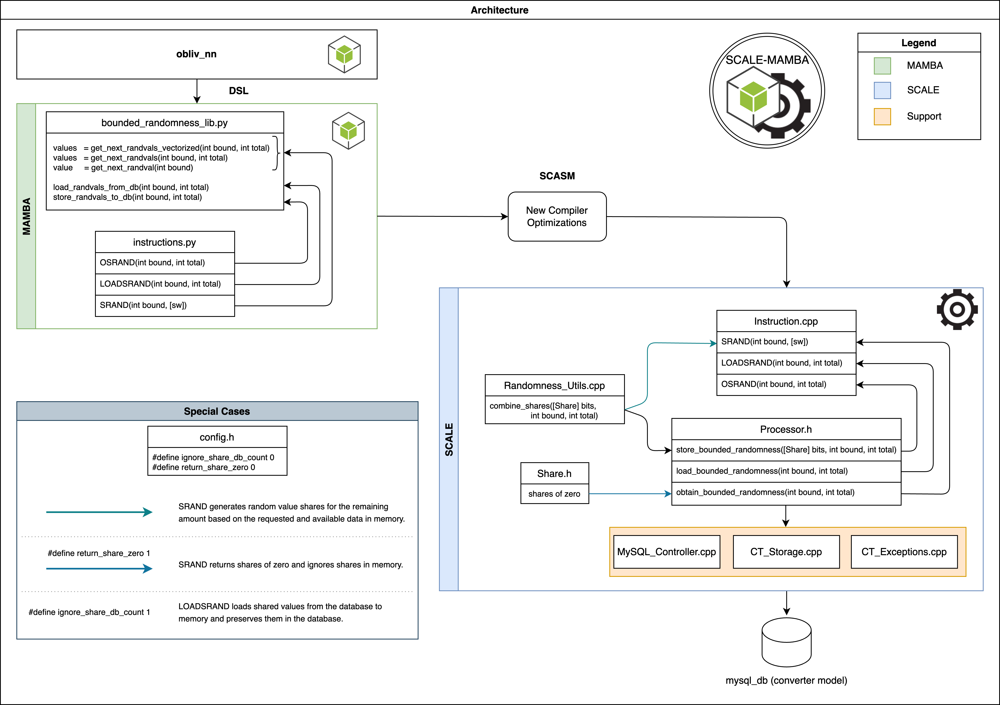

# Loading Bounded Randomness from a DB.
To save your RAM and make things efficient, the framework has a cool way to load bounded random values straight from a database when you need them. Here's how it works in three simple steps:

1. We generate a bunch of random values, like `total` of them, and keep them secret-shared in the parties' private databases. These random values are within a limit of `2^bound`.
2. At the start of the protocol, we load the required number of random values with the specific limit `bound` from the database into memory.
3. During the protocol execution, we use the random values from memory.

To handle all these tasks smoothly, we've added some new instructions, which we'll tell you more about later. Check out the design below to see how it all comes together, and we'll dive into more details about each component.

<div style = "text-align:center">
    
</div>

* **
## New System Instructions
The framework now supports 3 new different instructions, as well as a library for easy use. We note that, to maintain synergy with the original `SCALE MAMBA`, our new instructions work filling single vectors. The instructions are the following:

**`OSRAND(int, int)`:** The first value you give is the `bound`, which sets the limit (`2^bound`) for the random value you want to generate and store in the database. The second value, `total`, tells the system how many random values you want to create in a single `OSRAND` invocation. You can call this instruction as follows: 
```python
        bound = 32
        total = 100
        OSRAND(bound, total)
```

Please be aware that when the `OSRAND` instruction is used, it triggers the `store_bounded_randomness()` process located in [Processor.h](../src/Processor/Processor.h). This process, in turn, executes the `save_batch()` function, which is defined in [Converter_Storage.cpp](../src/Converter/Converter_Storage.cpp). It is important to note that the invocation of `store_bounded_randomness()` occurs in batches of `bounded_randomness_batch_size` (see more details [here](#batching-generation-of-bounded-random-values)). 

**`LOADSRAND(int, int)`:** This instruction, similar to the `OSRAND`, takes two `int` parameters namely `bound` and `total` as the inputs, but is used to load values from the DB into memory. It checks if the requested number of shared random values exist in the DB. If found, they are loaded to the memory (specifically to the multimap [bounded_randomness](../src/Processor/Processor.h)) and the entries are deleted from the DB using the `read_then_delete()` function defined in [Converter_Storage.cpp](../src/Converter/Converter_Storage.cpp). Otherwise, an exception is thrown indicating not enough shared random values of the requested `bound` in the DB. You can call this instruction as follows: 
```python
        bound = 32
        total = 100
        LOADSRAND(bound, total)
```

Furthermore, we maintain a record of the loaded random values by using their corresponding ID's from their DB entries. The `ID` of the most recent bounded value of type `bound` that was loaded is stored in the map called `last_retrieved_index_per_channel_randomness[bound]`, which is defined in the file [Processor.h](../src/Processor/Processor.h). The update of this map occurs within the process `load_bounded_randomness()` in the same [Processor.h](../src/Processor/Processor.h) file. 

**`SRAND(int, sw)`:** This instruction instantiate a shared random value within the limit according to the first parameter `int`, into the register `sw`. The process responsible for this is `obtain_bounded_randomness()`, which first checks if the required number of values is available in memory by checking the multimap [bounded_randomness](../src/Processor/Processor.h). If there are enough values, they are consumed and removed from the multimap. However, if there aren't enough values, the additional required amount is generated using the randomness generation logic of `OSRAND`, defined in [Instruction.cpp](../src/Processor/Instruction.cpp). You can call this instruction as follows: 
```python
        bound = 32
        total = 100
        value = sint()
        SRAND(bound, value)
```

**`vSRAND(int, int, sw)`:** This corresponds to the vectorized version of `SRAND` instruction. This instruction takes an additional `int` parameter denoting the `total` number of random values to be instantiated. You can call this instruction as follows: 
```python
        bound = 32
        total = 100
        values = sint(size=total)
        vSRAND(total, bound, values)
```

**`SRAND(int, [sw])`:** This is like the `SRAND` instruction invocation mentioned earlier, but with a difference: it accepts a list of registers `[sw]` as input and populates them with random values within a specified range. You can call this instruction as follows: 
```python
        bound = 32
        total = 100
        values = []
        [values.append(sint()) for _ in range(total)]
        SRAND(bound, *values)
```

## Bounded Randomness Library
We include also a new easy access library called [bounded_randomness_lib.py](../Compiler/bounded_randomness_lib.py). It encapsulates the calls to the instructions above, for easy access and management. The functionality available is stated below. We use `bound = 32` and `total = 100` in the description below for ease of presentation.

**Store Bounded Random Values `store_randvals_to_db(bound, total)`:** Here you parametrize a bound and the number of random values to be generated and stored. It returns no value. To store the bounded randomness in the DB, you can simply do the following:
```python
from Compiler.bounded_randomness_lib import  store_randvals_to_db

store_randvals_to_db(32, 100)
```

Furthermore, we have provided the end user with a simple script for generating the required amount of random values within a specified bound and storing them in the DB. To utilize this, users can simply run the script located at `Scripts/bounded-randomness-gen.sh`.

**Load Bounded Random Values `load_randvals_from_db(bound, total)`:** Here you parametrize a bound and the number of random values to be loaded from the DB to the memory. Please be aware that you need to have stored random values of the specified bound in the DB before invoking this function. It returns no value. To load bounded random values, you can simply do the following:
```python
from Compiler.bounded_randomness_lib import load_randvals_from_db

load_randvals_from_db(32, 100)
```

**Instantiate a Random Value by Its Bound `value = get_next_randval(bound)`:** It returns an `sint()` register that correspond to a random value within the limit `2^bound`. To instantiate a bounded random value, you can simply do the following: 
``` python
from Compiler.bounded_randomness_lib import get_next_randval

value = get_next_randval(32)

```

**Instantiate a Random Value by Its Bound (vectorized) `values = get_next_randvals_vectorized(bound, total)`:** This corresponds to the vectorized version of `get_next_randval()` above. This takes an additional parameter `total` as input denoting the number of random values to be generated. To instantiate bounded random values in a vectorized fashion, you can simply do the following: 
``` python
from Compiler.bounded_randomness_lib import get_next_randvals_vectorized

values = get_next_randvals_vectorized(32, 100)

```

**Instantiate a List of Random Values by Its Bound `values = get_next_randvals(bound, total)`:** It returns a list of `sint()` registers that correspond to random values, each within the limit `2^bound`. Note that the list `values` is iterable unlike the vectorized version above. To instantiate a list of bounded random values, you can simply do the following: 
``` python
from Compiler.bounded_randomness_lib import get_next_randvals

values = get_next_randvals(32, 100)

```

### Testing Bounded Randomness Library
To check the mentioned functions, simply run the test file named [test_bounded_randomness_lib](../Programs/test_bounded_randomness_lib/test_bounded_randomness_lib.mpc).


## Configuration
If you have your DB Configured via the [storage-config file](./storage-config-file.md), there is really **nothing else for you to do**. It's configuration is simple. It basically uses the same configuration file that you might have seen before when reading about [storage-config file](storage-config-file.md). **Indeed all our new future functionalities that depend on DB access will make use of the same file**. 

### Batching Generation of Bounded Random Values
The generation of random values using the `OSRAND` instruction involves a two-step process. First, it generates the necessary random bits, which are then combined to form random values within the desired range. However, we observe that generating all the required random values at once and then writing them to the DB hampers the performance.

To overcome this, we've adopted a batch approach. The process now waits until a specific number of random values, determined by the system parameter `bounded_randomness_batch_size` in [config.h](../src/config.h), are generated before proceeding to write them into the DB. By doing this, we can group all the values generated in a batch and write them to the database in a single transaction, significantly improving performance. You can edit the batch size by modifying the following:

```cpp
    /* Max batch bounded random elements it generates
     * via OSRAND. The process waits until enough bits are
     * available for the batch
     */
     #define bounded_randomness_batch_size 1000
```

**NOTE:** While we have control over the number of values to be inserted into the DB from the `SCALE-MAMBA` side, using the measures mentioned above, it's important to understand that the actual rate at which these values are inserted is determined by the parameter `MySQL_insert_batch_size`. This parameter is defined in separate [StorageConfig-P*.txt](../Data/StorageConfig-P0.txt) files for each participating party, directly affecting the rate of value insertion into the DB for that party's data.

### Testing Mode
We know how painful and time consuming can be to produce bounded randomness for testing. For that reason, we have incorporated now a system parameter `ignore_share_db_count` in [config.h](../src/config.h) that allows you to keep reusing the share you might have had stored in the DB. 

When activated `(set to 1)`, it queries shares starting always from `id = 1`. This basically means that you will be reusing the shares every time you invoke `LOADSRAND` and the corresponding entries are not deleted from the DB. To achieve this, we utilize the `read()` function from [Converter_Storage.cpp](../src/Converter/Converter_Storage.cpp) instead of the `read_then_delete()` function within the `load_bounded_randomness()` process defined in [Processor.h](../src/Processor/Processor.h). You can edit it as follows:

```cpp
    #define ignore_share_db_count 1 //change this to 0 to deactivate testing mode
```

Similarly, We have added a system parameter called `return_share_zero` to the [config.h](../src/config.h) file for testing the `SRAND` instruction. When this parameter is activated `(set to 1)`, the system ignores the bounded randomness shares loaded in memory and instead returns shares of `zero`. You can edit it as follows:

```cpp
    /* Ignores shares in memory for SRAND when set in 1.
     * It is used for testing to avoid consuming shares in DB.
     */
    #define return_share_zero 0
```
* **

## Contact Information:
If you have questions please contact any of the authors. Current repo maintainer is: [Abdelrahaman ALY](mailto:abdelrahaman.aly@tii.ae). 

## Authors:
Abdelrahaman ALY (@cloudTeam, CRC-TII)  
Ajith SURESH (@cloudTeam, CRC-TII)