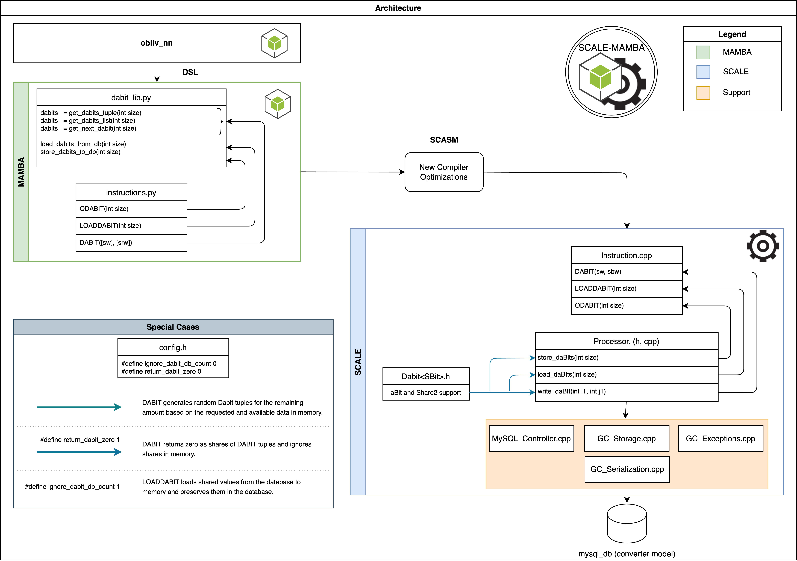

# Loading DABIT Tuples from a DB.
To optimize RAM usage and streamline operations, our framework offers a convenient method for accessing random [DABIT Tuples](https://eprint.iacr.org/2019/974.pdf) directly from a database (DB) whenever necessary. Here's a breakdown of the process in three straightforward steps:

1. We generate a set number of random DABIT Tuples, such as `size`, and securely store them in the private DBs of participating parties.
2. At the onset of the protocol, we retrieve the required DABIT Tuples from the DB and load them into memory.
3. Throughout the protocol execution, we utilize the DABIT Tuples stored in memory.

To ensure seamless execution of these tasks, we've introduced two new instructions, which we'll delve into further later on. Take a look at the outlined design below to grasp the overall workflow.

<div style = "text-align:center">
    
</div>

Among the most notorious architectonical decisions made on the Persistence of DABITs, we can count the following:

1. We manage this material via a novel [`authenticated_material table`](../database/schema-gc.sql). This table is thought to store all GC related authenticated material. 
2. Storage/Retrieval follows the offline garbling format. It means data is not erased after usage, and content of the material is encoded, either on `Base64` or `json`. 
3. Given the lack of other authenticated material being stored in this way, at present the type of the authenticated material that corresponds to DABITs and used for retrieval, is encoded in the novel [Dabit](../src/Mod2Engine/Dabit.h) datatype. 
4. The instructions reuse and adapt the pre-existing template infrastructure, so that all types of DABITs can be safely stored in the DB.
5. We respect and minimize the impact on pre-existing codebase. That means still respecting the places where DABIT extraction occurs and the logic behind it. 

* **

## New System Instructions
The framework incorporates two new instructions and adapt the existing `DABIT` instruction to accommodate these updates. Additionally, a user-friendly library has been integrated for convenient utilization. In alignment with the original `SCALE MAMBA`, our new instructions operate by filling single vectors. These instructions include:

**`ODABIT(int)`:** The argument value, `size`, tells the system how many random DABIT Tuples you want to create in a single `ODABIT` invocation. You can invoke this instruction from `MAMBA`, as follows: 
```python
        size = 100
        ODABIT(size)
```

Please note that when the `ODABIT` instruction is utilized, it generates the requested number of tuples in the form of a list `(bp, b2)` as specified in [Processor.cpp](../src/Processor/Processor.cpp). In this instance, `bp` is assumed to be modulo `p`, whereas `b2` is modulo 2. The `Processor` then triggers the corresponding serialization process either in `json` or `Base64`. By default, `Processor` supports `Base64`. Albeit this is not configurable, it is easy to change on the code base, by replacing the method call for serialization. We note, that the instruction supports the storage of `DABITS`, based on `[HSS17]` or Replicated Secret Sharing. It's essential to understand that the `store_daBits()` function uses templates to correctly identify and coordinate the calls.

**`LOADDABIT(int)`:** This instruction, like `ODABIT`, requires an integer parameter named `size` as input. Its purpose is to retrieve values from the DB and store them in memory. It verifies whether the requested number of shared DABIT Tuples exists in the DB. If they are found, they are loaded into memory, specifically into the vector [`dabits`](../src/Processor/Processor.h), and then marked as used from the DB using the `read()` function defined in [Gabled_Circuit_Storage.cpp](../src/GC/Garbled_Circuit_Storage.cpp). If the required number of shared DABIT Tuples is not available in the DB, an exception is thrown indicating insufficient Tuples. You can use this instruction as follows:
```python
        size = 100
        LOADDABIT(size)
```

Additionally, we do not keep track of indices given that we use the the DB approach used on Garbled Circuits. This means that we extract DABITs, irrespective of their order as long as they haven't been used. We distinguish between modulo p and modulo 2 DABITs by the presence of their associated [`Choicebits`](../src/OT/Choicebits.h). If they are there, the DABIT is modulo 2.

**`DABIT(sw, swr)`:** the instruction, initializes a shared random DABIT Tuple into the registers `sw, swr`. Mirror values on 2 different domains, the first one if modulo p and the second in modulo 2. The process responsible for this action is still `write_daBit()`, which is invoked after verifying if the necessary number of values is available in memory by examining the vector [`dabits`](../src/Processor/Processor.h). If a sufficient number of values are present, they are utilized and removed from the vector. However, if an insufficient number of values exist, the additional required amount is generated using the randomness generation logic of `ODABIT`, as defined in [Instruction.cpp](../src/Processor/Instruction.cpp). You can execute this instruction as shown below:
```python
        next_tuple = (sint(), sbit())
        dabit(*next_tuple)
```

**`vDABIT(int, sw, swr)`:** This corresponds to the vectorized implementation of the `DABIT` instruction. With this instruction, an extra `int` parameter is required, indicating the `size` number of DABIT tuples to generate. Consequently, for each position `i` with `0 ≤ i < size`, the values `(bp[i], b2[i])` constitute a random DABIT Tuple. You can execute this instruction as follows:
```python
        size = 100
        bp = sint(size=size)
        b2 = sbit(size=size)
        
        next_tuples = (bp, b2)
        vdabit(size, *next_tuples)
```

## Dabits Library
We've added a new convenient library named [dabits_lib.py](../Compiler/dabits_lib.py) for straightforward access. This library encapsulates the functions discussed earlier, simplifying their usage and organization. Below is a summary of the available functionality. For clarity in presentation, we'll use `size = 100` as an example value throughout the description.

**Store Random DABIT Tuples `store_dabits_to_db(size)`:** Here you parametrize the number of random DABIT Tuples to be generated and stored. It returns no value. To generate and store DABIT Tuples to the DB, you can simply do the following:
```python
from Compiler.dabit_lib import  store_dabits_to_db

store_dabits_to_db(100)
```

Additionally, we have provided the end user with a simple script for generating the required amount of random DABIT Tuples and storing them in the DB. To utilize this, users can simply run the script located at `Scripts/dabit-tuples-gen.sh`.
```bash
cd Scripts
./dabit-tuples-gen.sh
```


**Load Random DABIT Tuples `load_dabits_from_db(size)`:** Here you parametrize the number of random DABIT Tuples to be loaded from the DB to the memory. Please be aware that you need to have stored at least that many random DABIT Tuples in the DB before invoking this function. To load random DABIT Tuples, you can simply do the following:
```python
from Compiler.dabit_lib import load_dabit_from_db

load_dabit_from_db(100)
```

**Instantiate a Random DABIT Tuple `next_dabit = get_next_dabit()`:** It returns a `sint()`  and a `sbit()` registers that correspond to a random DABIT Tuple of the form `(bp, b2)`with both being the same bit on different domains. To instantiate a random DABIT Tuple, you can simply do the following: 
``` python
from Compiler.dabit_lib import get_next_dabit

next_dabit = get_next_dabit()
```

Moreover, you can parameterize the same function using `size`, where it returns a `sint()` and a `sbit()` registers of size `size`. To instantiate this variant, follow these steps:
``` python
from Compiler.dabit_lib import get_next_dabit

next_dabit = get_next_dabit(100)
```

**Generating Dabit Tuples as a List `next_dabits = get_dabits_list(size)`:** This function resembles `get_next_dabit()` but with a key difference: it returns 2 lists, one of `sint()` and another one `sbit()` sized `size`. Here, each `i` element represents a DABIT Tuple for `0 ≤ i < size`. To instantiate this variant, you can simply do the following: 
``` python
from Compiler.dabit_lib import get_dabit_list

next_dabits = get_dabit_list(100)
```

**Generating DABITs as actual Tuples `next_dabits = get_dabits_tuple(size)`:** This function returns a list of DABIT Tuples (`next_dabits`), where each `next_dabits[i]` corresponds to a DABIT for `0 ≤ i < size`. To instantiate this variant, you can simply do the following: 
``` python
from Compiler.dabit_lib import get_dabits_tuple

next_dabits = get_dabits_tuple(100)
```

### Testing DABITs Library
To check the mentioned functions, simply run the test file named [test_dabit_lib](../Programs/test_dabit_lib/test_dabit_lib.mpc). Not to be confused with other legacy DABIT testing programs.


## Configuration
If you have your DB Configured via the [storage-config file](./storage-config-file.md), there is really **nothing else for you to do**. It's configuration is simple. It basically uses the same configuration file that you might have seen before when reading about [storage-config file](storage-config-file.md). **Indeed all our new future functionalities that depend on DB access will make use of the same file**. 


**NOTE:** While we have control over the number of values to be inserted into the DB from the `SCALE-MAMBA` side, using the measures mentioned above, it's important to understand that the actual rate at which these values are inserted is determined by the parameter `MySQL_insert_batch_size`. This parameter is defined in separate [StorageConfig-P*.txt](../Data/StorageConfig-P0.txt) files for each participating party, directly affecting the rate of value insertion into the DB for that party's data.

### Testing Mode
We understand the challenges and time constraints involved in generating DABIT Tuples for testing purposes. To alleviate this, we have introduced a system parameter `ignore_dabit_db_count` in [config.h](../src/config.h) that enables you to reuse the tuples stored in the DB.

When activated (set to 1), this parameter retrieves tuples starting from `id = 1` each time you invoke `LOADDABIT`, and ensures that the corresponding entries are not marked as `used` in the DB. Once again, we follow the style of the [Garbled_Circtuit_Storage.h](../src/GC/Garbled_Circuit_Storage.h), meaning we directly include the flag on the implementation of the `save_dabits()` method itself. To activate this functionality, please do the following:

```cpp
#define ignore_dabit_db_count 1 //change this to 0 to deactivate testing mode
```

Similarly, we've introduced another system parameter named `return_dabit_zero` in the [config.h](../src/config.h) file specifically for testing the `DABIT` instruction. When this parameter is enabled (set to 1), the system disregards the DABIT Tuples loaded in memory and instead provides tuples of `zero`. You can configure it as follows:

```cpp
/* Ignores DABIT tuples in memory for DABIT TUPLEs when set to 1.
 * It is used for testing to avoid consuming shares in DB.
 */
#define return_dabit_zero 0
```

* **

## Contact Information:
If you have questions please contact any of the authors. Current repo maintainer is: [Abdelrahaman ALY](mailto:abdelrahaman.aly@tii.ae). 

## Authors: 
Abdelrahaman ALY (@cloudTeam, CRC-TII)