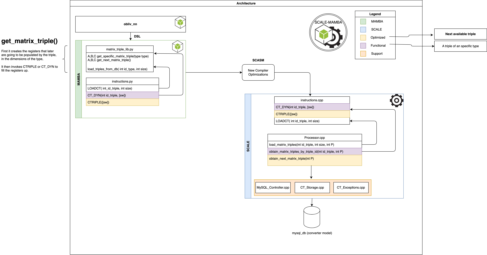

# Loading Matrix Triples from a DB.
To reduce the impact on your RAM consumption, the framework offers an easy medium to upload matrix triples when you need them, **ON DEMAND** to memory, directly from a DB. 
It works in a similar way to Offline Garbling, in the sense that it includes a `LOADCT` instruction,
in charge of loading the triples to memory, whenever you need it.

## Motivation
Given memory space can be fairly limited, we would like for users to avoid having to retain in memory all matrix triples that are needed from the start of the computation. `LOADCT` is a tool that will allow you to upload them, when you choose to, and only the amount you wanna hold in RAM at any given moment in time. 
<div style = "text-align:center">
    
</div>

* **

## What kind of triples can I load?
All kinds of Matrix Triples of any dimensions, you can introduce them into the framework easily and in the same way you do circuits now. as long as they come : 
* **Matrix Triples:** In the form `A, B, C`. Such that the Rows of `A` and Columns of `B`, define the dimensions of `C`. You can load a new type of triple via [Base_Matrix_Triple](../src/Converter/Base_Matrix_Triple.cpp). You just foollow what you see there. You will need to add a new line using the [Triple_Type_DTO](../src/Converter/Triple_Type_DTO.h) class as follows:

```cpp  
    //parameters correspond to the dimensions of A, B and C. 
    Triple_Type_DTO TT= Triple_Type_DTO(777777, 25, 2, 9, 4, 9, 2);
    Triple_Types.insert(make_pair(777777, TT ));
    last_retrieved_index_per_channel.insert(make_pair(777777, 0));
  ```
* **Neuronal Networks Triples:** In the form of A, B, C. Here dimensions of the 3 matrices are orthogonal. We use parameters **`(w, h, s, kh, kw, s_, stride, padding)`** to instantiate this type. You have to use a different class to instantiate, for instance, a Convolutional Triple Type, more specifically a [NN_Triple_Type_DTO](../src/Converter/Triple_Type_DTO.h) as follows:

```cpp
    // the parameters here align to the one of the convolution.
    TT = NN_Triple_Type_DTO(777778, 5, 5, 2, 3, 3, 2, 1, 0);
     Triple_Types.insert(make_pair(777778, TT));
    last_retrieved_index_per_channel.insert(make_pair(777778, 0));
```
* **

**NOTE:** Please remember that the triples in the correct dimensions or at least enough shares, need to be present in the DB so that you can retreive them in the shapes instantiated by any types you might have. 

## Configuration
If you have your DB Configured via the [storage-config file](./storage-config-file.md), there is really **nothing else for you to do**. It's configuration is simple. It basically uses the same configuration file that you might have seen before when reading about [Offline Garbling](storage-config-file.md). **Indeed all our new future functionalities thatdepend on DB access will make use of the same file**. 

### Testing Mode
We know how painful and timeconsuming can be to produce triples for testing. For that reason, we have incorporated now a system parameter in [config.h](../src/config.h) that allows you to keep reusing the share you migh have had sotred in the DB. 

When activated `(set in 1)`, it queries shares starting always from `id =1`. This basically means that you will be reusing the shares every time you invoke `LOADCT`. You can edit it as follows:

```cpp
    #define ignore_share_db_count 1 //change this to 0 to deactivate testing mode
```
## New System Instructions
The framework now supports 3 new different instructions, as well as a library for easy use. We note that, to mantain synergy with the original `SCALE MAMBA`, our new instructions work filling single vectors. The instrucitons are the following:

**`LOADCT(int, int)`:** The first value is the `id` of the matrix triple you would like to load. The second  value  corresponds to the number of matrix triples you would like to upload on this `LOADCT` invocation. you can call the instruction as follows: 
```python
        triple_type_id = 777777
        total = 3
        LOADCT(triple_type_id, total)
```
**`CT_DYN(int, [sw])`:** This instruction instantiate a matrix triple of the type of the first parameter `int`, into the list of registers `[sw]`.  Please be aware that you must have load triples in memory before you invoke  `CT_DYN`. You can call this instruction as follows: 
```python
       values = []
       triple_type_id = 777777
       [values.append(sint()) for _ in range(triple_type.get_total_shares())]
       CT_DYN(triple_type_id, *values)
```
**`CTRIPLE([sw])`:** We understand that in many ocassions you will know what you are doing quite well and/or will be loading only 1 type of Matrix Triple. For those occassions and to simplify your development time and optimize the instatiation of the triple, we include `CTRIPLE`. As `CT_DYN`, it instantiates the next available triple on the triple stack. You need to have previously load triples to call `CTRIPLE`. Finally, note that we need to let `MAMBA` know how to interpet the registers it is about to parametrize, hence, when using this instruction you need to set up the `ONLY_TYPE` paramer from the [TripleType](../Compiler/matrix_triple_lib.py) class. On **why would you use CTRIPLE at all**. The instruction is slightly optimized (the compiler groups all invocations off `CTRIPLE` in 1, regadless how many times you write the instruction in your code, and a leaner extraction process). You can invoke this instruction as follows: 
```python
    TripleType.ONLY_TYPE = TRIPLE_TYPES.LENET_1_1
    [values.append(sint()) for _ in range(TripleType.ONLY_TYPE.get_total_shares())]
    CTRIPLE(*values)
```

## Matrix Triple Libray
We include also a new easy acces library called [matrix_triple_lib.py](../Compiler/matrix_triple_lib.py). It encapsulates the calls to the instructions above, for easy access and management. The functionality avaliable is stated below:

**Load Triples `load_triples_from_db(triple_type, total)`:** Here you parametrize a type of triple from the enum [triple_type](../Compiler/matrix_triple_lib.py) and the number of matrix triples. It returns no value. To load triples, you can simply do the following:
 ```python
        from Compiler.matrix_triple_lib import  TRIPLE_TYPES, 
                                                load_triples_from_db

        load_triples_from_db(TRIPLE_TYPES.LENET_1_1, 3)
 ```
 **Instantiate a Triple by Its Type `A, B, C = get_specific_matrix_triple(TRIPLE_TYPES.LENET_1_1)`:** It returns 3 `python` vectors that correspond to matrices `A, B` and `C` of the specified type from the enum [triple_type](../Compiler/matrix_triple_lib.py). Please be aware that you need to have uploaded triples of the specified type before invking this function. To instantiate a matrix triple, you can simply do the following: 
 ``` python
        from Compiler.matrix_triple_lib import TRIPLE_TYPES, 
                                                load_triples_from_db, 
                                                get_specific_matrix_triple

        load_triples_from_db(TRIPLE_TYPES.LENET_1_1, 3)
        A, B, C = get_specific_matrix_triple(TRIPLE_TYPES.LENET_1_1)

 ```
  **Instantiate Next Available Triple `A, B, C = get_next_matrix_triple()`:** It returns 3 `python` vectors that correspond to matrices `A, B` and `C` of the specified type fin [TripleType.ONLY_TYPE](../Compiler/matrix_triple_lib.py). Note this type is not involved in the instantiation, but it helps the `MAMBA` code to identify how many registers to send in the instruction call. To instantiate the next available matrix triple, you can simply do the following:
  ```python
        from Compiler.matrix_triple_lib import TRIPLE_TYPES, 
                                                load_triples_from_db, 
                                                set_ONLY_TYPE, 
                                                get_next_matrix_triple
        
        set_ONLY_TYPE(TRIPLE_TYPES.LENET_1_1)                                                
        load_triples_from_db(TRIPLE_TYPES.LENET_1_1, 3)
        A, B, C = get_next_matrix_triple()

  ```
**Create new Matrix Triple Types `class TRYPLE_TYPE`:** You can create new types of matrix triples that **NEED TO MATCH THE ONES ON [Base_Matrix_Triple.cpp](../src/Converter/Base_Matrix_Triple.cpp)**. In the same way that there you can instantiate Matrix Triples and Convolutional Triples, you can do so here via [TripleType](../Compiler/matrix_triple_lib.py) and [NNTripleType](../Compiler/matrix_triple_lib.py). Instance parametrization works as described above for [Base_Matrix_Triple.cpp](../src/Converter/Base_Matrix_Triple.cpp). To create new types you can simply do the following in [matrix_triple_lib.py](../Compiler/matrix_triple_lib.py):
```python
   # ########### Custom Matrix Triple Types Below this Line ###########
    #             Types need to match Base_Matrix_Triple.cpp

    LENET_1_3 = TripleType(777779, 25, 2, 9, 4, 9, 2)
    LENET_1_4 = ConvolutionTripleType(777780, 5, 5, 2, 3, 3, 2, 1, 0)
``` 

**NOTE:** We follow the formatting of the instructions from Offline Garbling and the mod 2 functionality from `SCALE-MAMBA`. That is names are capitalized in MAMBA. 
* **
## RoadMap
We plan future changes for `LOADCT`. Specifically related to the offline generation of triples. We are working on the following:

* Adapt the DB model, including erasing or flagging used shares. Currently the usage way is more aligned towards the way the IO works. 

* File Support for the matrix triple types, that is distributed to both, Python and C++ at the same time.

## Contact Information:
If you have questions please contact any of the authors. Current repo maintainer is: [Abdelrahaman ALY](mailto:abdelrahaman.aly@tii.ae). 

## Authors:
Abdelrahaman ALY (@cloudTeam, CRC-TII)
