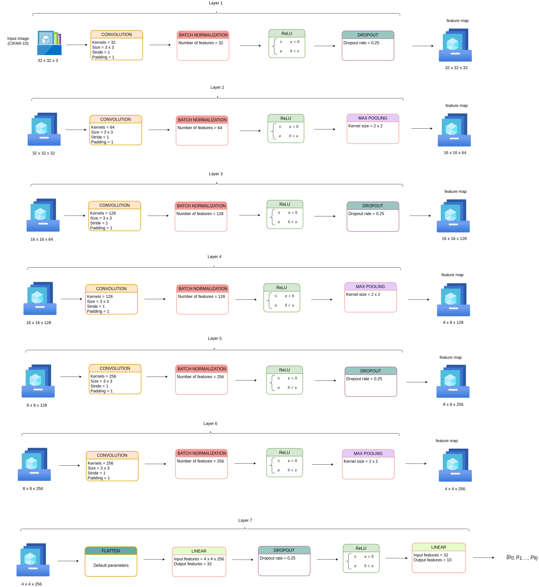

# What is this repository for? #

This repository consists of a 7-layered CNN architecture (named as pruned-ResNet) that can classify 32 x 32 color (RGB) images of CIFAR-10 dataset with more than 86 % accuracy.

# Requirements #
All the requirements to get the project running have been mentioned in the `requirements.txt` file. The Python version required is `3.8.15`.

# Here is a brief summary of each folder/file in this repository: #

* **Pruned_Resnet_CNN** - This directory contains the input and output of each layer for the pruned-ResNet CNN architecture for CIFAR-10 dataset, the python code for pruned-ResNet (in both format - python file and jupyter notebook), and the required dataset (CIFAR-10). The input and output of each layer for pruned-ResNet is stored in a format which is suitable to carry out inference in Scale-Mamba. `info_of_model_for_inference_txt_format` contains all the input and output for each layer.
 

* **/Pruned_Resnet_CNN/cifar10.tgz** - It contains raw CIFAR-10 dataset.
 

* **/Pruned_Resnet_CNN/Pruned_Resnet_CNN.ipynb** - This file contains the code to create the CNN architecture, train it, and save the model in `.onnx` and `.pth` format. It also gives the information about the total number of parameters and total number of operations for the CNN model. This file contains the code in `.ipynb` format (jupyter notebook).
 

* **/Pruned_Resnet_CNN/Pruned_Resnet_CNN.py** - This file contains the code to create the CNN architecture, train it, and save the model in `.onnx` and `.pth` format. It also gives the information about the total number of parameters and total number of operations for the CNN model. This file contains the code in `.py` format (python file).
 

* **/Pruned_Resnet_CNN/data** - This directory contains the data after extracting it from raw data (`cifar10.tgz`). This data will be used for training.
 

* **/Pruned_Resnet_CNN/diagram** - This directory contains the schematic diagram of the CNN architecture.
 

* **/Pruned_Resnet_CNN/inference** - This directory contains the python code (in both format - python file and jupyter notebook) to perform inference using 3 test images and the saved model, stored in `/Pruned_Resnet_CNN/inference/test_images` and `/Pruned_Resnet_CNN/saved_model` respectively. It also contains the python code (in both format - jupyter notebook and python file) to extract the input and output of each layer which is obtained during inference and to extract the model's parameters.
 

* **/Pruned_Resnet_CNN/saved_model** - This directory contains the saved model as a result of training.
 

* **requirements.txt** - This file contains all the required dependencies to get the project running.

# How to run the project? #

### Following are the steps to run the project (perform inference using PyTorch): ###

* Open the Jupyter notebook of inference `tii-cnn-cifar10-pytorch/Pruned_Resnet_CNN/inference/inference_cifar10.ipynb`.
* Make sure you have installed all the requirements from `tii-cnn-cifar10-pytorch/requirements.txt` and you have Python version `3.8.15`.
* Run the cells of the Jupyter notebook one by one.
 

# Results #

## Comparative analysis of ResNet-18 and 7-layered CNN for CIFAR-10 ##

| CNN architecture  | No. of parameters (million)   | No. of operations (GMAC)| Accuracy (%)|
| ------------------| ------------------------------|-------------------------|-------------|
| ResNet-18         | 11.69                         | 1.82                    | 90          |
| CNN for CIFAR-10  | 1.26                          | 0.13                    | 86.97       |

## Diagram of pruned-ResNet (7-layered CNN for CIFAR-10 dataset) ##

 

## Parameters

Range of channels reserved: **100020 - 100049**

Channels in use:

### Bias
- 100020 → PrunedResnetData/all_parameters/bias/P0-conv_layer_1_bias.txt
- 100021 → PrunedResnetData/all_parameters/bias/P0-conv_layer_2_bias.txt
- 100022 → PrunedResnetData/all_parameters/bias/P0-conv_layer_3_bias.txt
- 100023 → PrunedResnetData/all_parameters/bias/P0-conv_layer_4_bias.txt
- 100024 → PrunedResnetData/all_parameters/bias/P0-conv_layer_5_bias.txt
- 100025 → PrunedResnetData/all_parameters/bias/P0-conv_layer_6_bias.txt
- 100026 → PrunedResnetData/all_parameters/bias/P0-linear_layer_1_bias.txt
- 100027 → PrunedResnetData/all_parameters/bias/P0-linear_layer_2_bias.txt

### Beta

- 100028 → PrunedResnetData/all_parameters/new_beta/P0-bn_layer_1_new_beta.txt
- 100029 → PrunedResnetData/all_parameters/new_beta/P0-bn_layer_2_new_beta.txt
- 100030 → PrunedResnetData/all_parameters/new_beta/P0-bn_layer_3_new_beta.txt
- 100031 → PrunedResnetData/all_parameters/new_beta/P0-bn_layer_4_new_beta.txt
- 100032 → PrunedResnetData/all_parameters/new_beta/P0-bn_layer_5_new_beta.txt
- 100033 → PrunedResnetData/all_parameters/new_beta/P0-bn_layer_6_new_beta.txt

### Gamma

- 100034 → PrunedResnetData/all_parameters/new_gamma/P0-bn_layer_1_new_gamma.txt
- 100035 → PrunedResnetData/all_parameters/new_gamma/P0-bn_layer_2_new_gamma.txt
- 100036 → PrunedResnetData/all_parameters/new_gamma/P0-bn_layer_3_new_gamma.txt
- 100037 → PrunedResnetData/all_parameters/new_gamma/P0-bn_layer_4_new_gamma.txt
- 100038 → PrunedResnetData/all_parameters/new_gamma/P0-bn_layer_5_new_gamma.txt
- 100039 → PrunedResnetData/all_parameters/new_gamma/P0-bn_layer_6_new_gamma.txt

### Weights

- 100040 → PrunedResnetData/all_parameters/weights/P0-conv_layer_1_weight.txt
- 100041 → PrunedResnetData/all_parameters/weights/P0-conv_layer_2_weight.txt
- 100042 → PrunedResnetData/all_parameters/weights/P0-conv_layer_3_weight.txt
- 100043 → PrunedResnetData/all_parameters/weights/P0-conv_layer_4_weight.txt
- 100044 → PrunedResnetData/all_parameters/weights/P0-conv_layer_5_weight.txt
- 100045 → PrunedResnetData/all_parameters/weights/P0-conv_layer_6_weight.txt
- 100046 → PrunedResnetData/all_parameters/weights/P0-linear_layer_1_weight.txt
- 100047 → PrunedResnetData/all_parameters/weights/P0-linear_layer_2_weight.txt

## First layer input

Range of channels reserved: **90050 - 90059**

- 90050 → execution 1 ./PrunedResnetData/Inputs/Execution_0/P0-Conv_layer_1.input.txt

# Who do I talk to? #

Please contact Saurav Pawar for any further queries via Slack, Microsoft Teams, or Email (saurav.pawar@tii.ae).
